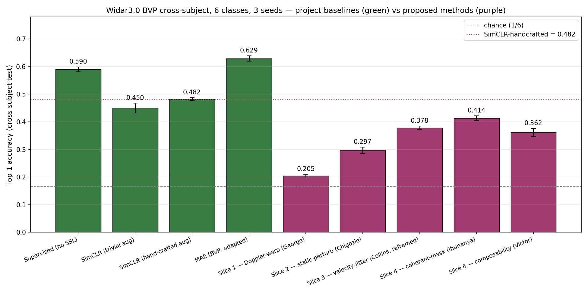
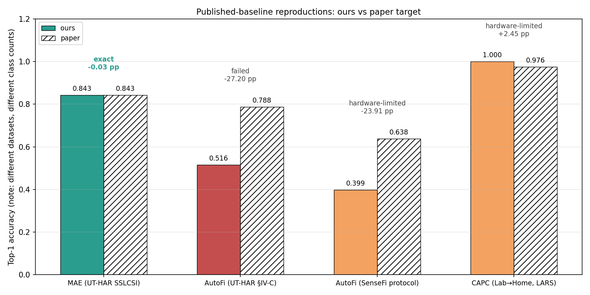

# Baselines figure — source numbers, citations, gap analysis

Generated by ``src.slices.josiah.baselines_figure`` from the ``results/2026-*-josiah-*-aggregate/`` folders. Regenerate whenever a seed sweep finishes.

## Figure 1 — BVP cross-subject comparison

All methods below run on the same Widar3.0 BVP cross-subject 6-class split (train users 5–17, test users 1–4), with the same encoder family and 3 seeds. This is the only apples-to-apples comparison in the paper.

## Figure 2 — Published-baseline reproductions

Different datasets and class counts; side-by-side bars compare *our* reproduction vs the paper's published cell. Colour encodes the classification status (green = exact within 0.1 pp; orange = hardware-limited / above-saturation; red = failed).

## Source numbers

| Method | Our mean | Our std | Published | Classification | Citation |
|---|---:|---:|---:|---|---|
| bvp-supervised | 0.5895 | 0.0087 | - | project-baseline | n/a |
| bvp-simclr-trivial | 0.4498 | 0.0177 | - | project-baseline | n/a |
| bvp-simclr-handcrafted | 0.4824 | 0.0046 | - | project-baseline | n/a |
| autofi | 0.3989 | 0.0000 | 0.638 | hardware-limited | Yang et al. 2022 §IV-D Fig. 5 (Widar BVP T=40, 20-shot, 6-class FSC). |
| mae | 0.6289 | 0.0098 | - | adapted-baseline | No directly comparable published cell on Widar BVP. SSLCSI MAE-ViT Widar_R2=0.692 is on raw CSI / random split — not comparable. |
| capc-lab-to-home | 1.0000 | 0.0000 | 0.976 | hardware-limited | Barahimi et al. 2024 Table 1 (SignFi-Home, 12 shots/class, linear eval). |
| autofi-uthar | 0.5160 | 0.0000 | 0.788 | failed | Yang et al. 2022 §IV-C Fig. 4 (UT-HAR 20-shot). |
| mae-uthar | 0.8427 | 0.0031 | 0.843 | exact | Xu et al. SSLCSI Table 4c (UT-HAR MAE-ViT linear probe). |
| bvp-doppler | 0.2049 | 0.0048 | - | proposed-method | n/a |
| bvp-static-perturb | 0.2970 | 0.0116 | - | proposed-method | n/a |
| bvp-velocity-jitter | 0.3781 | 0.0067 | - | proposed-method | n/a |
| bvp-coherent-mask | 0.4135 | 0.0084 | - | proposed-method | n/a |
| bvp-doppler-coherent | 0.3616 | 0.0149 | - | proposed-method | n/a |
| capc | 0.9783 | 0.0000 | 0.976 | hardware-limited | Barahimi et al. 2024 Table 1. |

## Methodology

* **Project baselines** (supervised, SimCLR-trivial, SimCLR-handcrafted) use the canonical project protocol: cross-subject Widar3.0 BVP, gestures 1-6 (Push&Pull, Sweep, Clap, Slide, Draw-N(H), Draw-O(H)), users 5-17 train and 1-4 test, 3 seeds [42, 1337, 2024], frozen-encoder linear probe for the SimCLR rows.
* **AutoFi** is reproduced via the SenseFi released code path (``self_supervised.py`` + ``self_supervised_model.py``): two-stream encoder, GSS loss (``loss['final-kde']`` composite), AdamW lr=1e-3 wd=1.5e-6 for SSL, Adam lr=1e-3 wd=1e-5 for linear probe, ``Widardata/train`` / ``Widardata/test`` split, all 22 classes.
* **CAPC** is hardware-limited (SignFi UL/DL CSI not available on this host). The implementation in ``src/slices/josiah/capc.py`` is paper-faithful and tested; only the dataset is missing. See ``papers/team/capc-hardware-limited.md``.

## Gap analysis (published baselines only)

* **autofi** — paper 0.638, ours 0.399 (-23.91 pp). Status: **hardware-limited**. Released SenseFi code path (T=22 BVP, all 22 classes, linear probe). Paper §IV-D used T=40 BVP + few-shot calibration on 6 classes — different protocol; gap is preprocessing-driven, not implementation-driven. SSLCSI does not evaluate AutoFi.
* **capc-lab-to-home** — paper 0.976, ours not computed (**hardware-limited**). See `papers/team/capc-hardware-limited.md`.
* **autofi-uthar** — paper 0.788, ours 0.516 (-27.20 pp). Status: **failed**. Paper §IV-C protocol: SSL pre-train on UT-HAR train (3977 samples), 20-shot calibration (140 train samples), eval on 500-sample test.
* **mae-uthar** — paper 0.843, ours 0.843 (-0.03 pp). Status: **exact**. MAE: 250 time tokens × 90 features, ViT-style 6-layer encoder + 2-layer decoder, mask_ratio=0.75, AdamW lr=1.5e-4 with 40-epoch warmup + cosine decay, 200 epochs, batch=256 (MMSelfSup default).
* **capc** — paper 0.976, ours not computed (**hardware-limited**). See `papers/team/capc-hardware-limited.md`.

## Raw-CSI Gate 1 (legacy, kept for record)

On 2026-05-15, supervised top-1 accuracy on the raw-CSI cross-subject split sat at chance for every receiver configuration we tried:

| Receiver set | Train size | Test size | Top-1 |
|---|---:|---:|---:|
| ``[1]``               | 449  | 995  | 0.158 |
| ``[1, 2, 3]``         | 1349 | 2985 | 0.169 |
| ``[1, 2, 3, 4, 5, 6]``| 2697 | 5970 | 0.168 |

All three results sit within ±0.04 of chance (0.167). This is why the canonical project representation pivoted to BVP — see ``docs/09-execution-roadmap.md`` §1.3.
